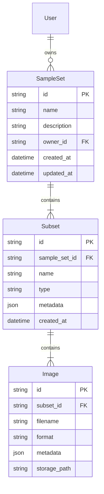
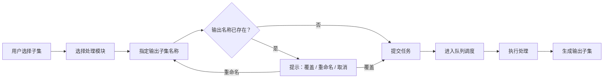

# MedSeg Cloud — 产品需求文档 (PRD)

## 1 · 文档概述

| 项目名称 | MedSeg Cloud — 医学图像云端处理与标注系统 |
| --- | --- |
| 文档版本 | v1.0 |
| 作者 | Orange |
| 日期 | 2026-04-11 |
| 状态 | Draft |

---

## 2 · 产品愿景与目标

### 2.1 产品愿景

构建一个面向临床与科研场景的 **医学图像云端处理平台**，用户通过浏览器即可完成医学图像的上传、预览、预处理、AI 推理（分割等）以及手动标注的全流程操作，降低医学影像处理的技术门槛与环境配置负担。

### 2.2 核心目标

- **零部署**：用户无需安装任何本地软件，全部操作在浏览器中完成
- **可扩展**：后端处理管线采用可插拔架构，可灵活接入新的预处理 / AI 推理模块
- **高效调度**：智能任务队列兼顾 GPU 亲和性与公平性，最大化 GPU 利用率
- **协作共享**：支持用户间样本集共享与权限管理

---

## 3 · 技术栈

| **层级** | **技术选型** | **说明** |
| --- | --- | --- |
| 前端框架 | React Router v7 + Tailwind CSS + Shadcn UI | SPA 路由、实用优先 CSS、无样式组件库 |
| 医学影像前端 | Cornerstone3D + Cornerstone Tools | NIfTI / DICOM 渲染、MPR 视图、手动分割工具 |
| 后端框架 | Python FastAPI | 异步 REST API，WebSocket 实时推送 |
| ORM / 数据库 | SQLModel (SQLAlchemy + Pydantic) | 类型安全的数据建模与查询 |
| 任务队列 | 自研调度器（见 §6） | 多队列 + 动态优先级 + 显存淘汰 |
| 对象存储 | 待定（本地 / S3 兼容） | 存放 NIfTI / DICOM 文件 |

---

## 4 · 用户角色

| **角色** | **描述** | **典型权限** |
| --- | --- | --- |
| 普通用户 | 临床医生 / 研究人员 | 上传样本、运行管线、预览 / 标注、管理自己的样本库、分享样本集 |
| 管理员 | 系统运维人员 | 用户管理、模块管理、查看和管理所有用户样本库 |

---

## 5 · 功能需求

### FR-1 可插拔处理管线

#### FR-1.1 模块接口规范

每个处理模块必须实现统一的 **Pipeline Module Interface**，包含：

| **接口方法** | **输入** | **输出** | **说明** |
| --- | --- | --- | --- |
| `module_info()` | — | `ModuleInfo` | 返回模块名称、版本、描述、建议优先级等元信息 |
| `check_availability(sample_set_meta)` | 样本集元数据 | `AvailabilityResult` | 返回 `unavailable` / `available` / `recommended` 及对应子集 ID 列表 |
| `load()` | — | — | 加载模型到 GPU / 内存 |
| `unload()` | — | — | 卸载模型，释放 GPU 显存 / 内存 |
| `run(input_subset)` | 输入子集路径 + 参数 | 输出子集 | 执行处理，生成新的子集 |

#### FR-1.2 模块参数声明与校验

- 每个处理模块可在接口中通过 Pydantic 模型 **声明运行参数**（参数名、类型、默认值、约束等）
- 模块的参数列表随 `module_info()` 一并暴露到前端
- 用户运行需要参数的处理模块时，前端根据参数声明动态渲染表单，供用户填写
- 任务提交时，后端使用 **Pydantic** 对参数进行校验；校验失败的任务 **立即返回错误**，并向用户展示具体的校验失败原因，不进入队列

#### FR-1.3 动态加载与卸载

- 后端在启动时扫描模块注册目录，发现并注册符合接口的模块
- 管理员可在后台启用 / 禁用模块
- 模块支持运行时动态 `load()` 和 `unload()`
- 可同时加载多个模块（受显存限制）
- 用户在 UI 中可从"已启用模块"列表中选择要运行的模块

#### FR-1.4 资源感知

- 每个处理模块可在 `module_info()` 中 **声明自身所需的最大内存和显存**（如 `max_ram_mb`、`max_vram_mb`）
- 系统维护一个 **资源使用阈值**（可配置，默认为系统总内存 / 显存的 **80%**）
- 加载模块时，系统计算 **已加载模块占用之和 + 即将加载模块的声明需求**；若总和超过阈值，则 **触发淘汰策略**（参见 FR-2.3），逐步卸载低优先级模块释放资源，直到剩余可用资源能容纳新模块
- 若卸载所有可淘汰模块后仍无法满足需求，则拒绝加载并向用户返回资源不足提示

---

### FR-2 任务管理与智能调度

#### FR-2.1 任务队列架构

- **每个 AI 模块维护一个独立的 FIFO 队列**（模型任务队列组）
- 用户提交处理请求后进入对应模块队列尾部
- 前端实时显示排队位置与预计等待时间

#### FR-2.2 动态优先级调度算法

调度器每次选取下一任务时，计算各队列队头任务的 **动态优先级得分**：

$P_i(t) = W_i(t) + B \cdot I(M_i \in L)$

| **符号** | **含义** |
| --- | --- |
| $P_i(t)$ | 队列 $i$ 队头任务在时刻 $t$ 的优先级得分 |
| $W_i(t)$ | 队列 $i$ 队头任务已等待时间（ms）— 防饥饿核心 |
| $M_i$ | 队列 $i$ 对应的 AI 模块 |
| $L$ | 当前已加载到 GPU 的模块集合 |
| $I(M_i \in L)$ | 指示函数：模块已加载为 1，否则为 0 |
| $B$ | 亲和性奖励常数（时间单位），代表"为避免切换模型愿意让其他任务多等的时间上限" |

**调度流程**：

1. 遍历所有非空队列，计算队头 $P_i(t)$
2. 选取 $P_i(t)$ 最大的队列
3. 若该模块已加载 → 直接执行
4. 若该模块未加载 → 触发显存淘汰策略（见 FR-2.3），加载模块后执行

#### FR-2.3 资源淘汰策略

当需要加载新模块但内存/显存不足时：

1. **优先卸载**：队列为空的已加载模块
2. **其次卸载**：队头等待时间最短（$W_i(t)$ 最小）的队列对应的已加载模块
3. 卸载后释放显存，加载目标模块

#### FR-2.4 前端排队信息

- 用户提交任务后，前端展示：
    - 当前排队位置
    - 预计等待时间（基于历史平均处理时长估算）
    - 任务状态：排队中 → 加载模型中 → 处理中 → 已完成 / 失败
- 使用 WebSocket 实时推送任务状态变更

---

### FR-3 样本管理

#### FR-3.1 数据模型



#### FR-3.2 样本集 (SampleSet)

- 来自同一次检查（Study）的多模态医学图像组织到同一个样本集
- 样本集包含一个或多个 **子集 (Subset)**
- 子集为扁平结构（**仅支持一层**，不支持嵌套子集）

#### FR-3.3 子集 (Subset)

子集是处理管线的 **输入和输出单位**。

- 子集的 **类型和元数据均为任意值**，完全取决于处理模块的返回结果；系统不对子集类型做枚举限制
- 经过处理管线产生的子集会由系统 **自动填充来源元数据**（处理模块名称、源子集 ID、源图像 ID 映射、参数快照等），其余元数据字段由模块自行定义
- 前端通过元数据中的 **特殊标志字段**（如 `is_segmentation: true`）判断子集是否为分割结果，而非依赖子集类型字段

常见子集类型示例（仅作参考，非硬编码枚举）：

| **子集类型** | **来源** | **典型元数据字段** |
| --- | --- | --- |
| 原始 (raw) | 用户上传 | 上传时间、上传者、模态信息 |
| 标准化 (normalized) | 预处理管线 | 预处理方式、源子集 ID、源图像 ID 映射 |
| 分割结果 (segmentation) | 分割管线 | `is_segmentation: true`、分割模型名称与版本、源子集 ID、源图像 ID 映射 |
| 自定义 | 其他模块 | 由模块自行定义，遵循通用 JSON schema |

#### FR-3.4 图像 (Image)

- 每张图像标注格式标签：`DICOM`、`NIfTI` 等
- 携带格式特定元数据（DICOM header 摘要 / NIfTI affine 等）

#### FR-3.5 分割结果叠加显示

- 打开分割结果子集时，系统根据元数据中的 **源子集 ID + 源图像 ID 映射**，自动加载对应原始图像
- 前端根据子集元数据中的 `is_segmentation` 标志判定该子集为分割结果，进而触发叠加显示逻辑
- Cornerstone3D 将分割 mask 以半透明彩色覆盖层叠加到原始图像上

---

### FR-4 处理管线运行

#### FR-4.1 运行流程



#### FR-4.2 输入输出约定

- **输入**：一个子集（模块可从元数据获取样本集上下文）
- **输出**：一个新的子集，挂载到同一样本集下
- 输出子集自动填充来源元数据（处理模块、源子集 ID、参数快照等）

#### FR-4.3 命名冲突处理

- 用户可自定义输出子集名称
- 若同名子集已存在：弹窗提示 **覆盖 / 重命名 / 取消** 三个选项
- 覆盖操作将删除旧子集及其全部图像

---

### FR-5 处理管线感知（Pipeline Awareness）

#### FR-5.1 可用性检测接口

系统在用户打开样本集界面时，向所有已启用模块调用 `check_availability(sample_set_meta)`。

模块返回值：

```
{
  status: "unavailable" | "available" | "recommended",
  target_subset_ids: [...]   // 可运行 / 建议运行的子集 ID 列表
  reason?: string            // 可选的说明文字
}
```

#### FR-5.2 判断规则示例

| **模块** | **unavailable** | **available** | **recommended** |
| --- | --- | --- | --- |
| 标准化 | 无原始子集 | 存在原始子集且已有标准化子集 | 存在原始子集但无对应标准化子集 |
| 分割 | 无所需标准化子集 | 存在标准化子集且已有分割结果 | 存在标准化子集但无分割结果，或新增了模态图像 |

> 具体判断逻辑由模块自身实现，系统仅提供样本集元数据并收集返回值。
> 

#### FR-5.3 建议优先级

- 每个模块在 `module_info()` 中声明一个 **建议优先级** (suggestion_priority: int)
- 例如：标准化 = 100，分割 = 200（值越小优先级越高）
- 此优先级 **仅影响 UI 显示顺序**，不影响任务调度

#### FR-5.4 UI 展示

- 样本集界面顶部显示 **建议操作卡片**（最高优先级的 `recommended` 模块）
- 一键运行按钮 → 自动填充输入子集与输出名称 → 进入 FR-4 流程
- 其他可用 / 建议模块折叠在"更多操作"菜单中
- **注意**：管线感知在模块卸载时仍然运行（`check_availability` 不要求模型加载）

---

### FR-6 样本库

#### FR-6.1 个人样本库

- 每位用户拥有独立的样本库
- 样本库采用 **目录树** 组织结构（文件夹 + 样本集）
- 支持创建 / 重命名 / 移动 / 删除文件夹与样本集

#### FR-6.2 共享样本库

- 用户可将自己的样本集 **发布到共享样本库**
- 共享样本库对所有用户可见（只读浏览）
- 非所有者若需编辑，需先 **复制** 到自己的样本库（深拷贝）
- 所有者可随时撤回共享

---

### FR-7 用户界面

#### FR-7.1 整体布局


- **侧边栏（资源浏览器）**：
    - 目录树展示个人样本库 / 共享样本库
    - 样本集展开后显示子集列表（扁平一层）
    - 支持拖拽移动、右键菜单
- **中央区域（预览 / 编辑）**：
    - Cornerstone3D 渲染 NIfTI / DICOM 图像
    - 支持 MPR（多平面重建）三视图
    - Cornerstone Tools 提供画笔、橡皮擦、阈值分割等手动标注工具
    - 分割结果叠加原始图像显示

#### FR-7.2 关键页面

| **页面** | **功能** |
| --- | --- |
| 样本库页 | 目录树浏览、搜索、上传、新建文件夹 |
| 样本集详情页 | 子集列表、管线感知建议卡片、运行处理、查看元数据 |
| 预览 / 编辑页 | Cornerstone3D 渲染、手动标注、分割叠加、导出 |
| 任务中心 | 当前任务列表、排队状态、历史记录 |
| 共享样本库 | 浏览共享样本、复制到个人库 |
| 管理后台 | 用户管理、模块管理、全局样本库管理 |

---

### FR-8 管理后台

#### FR-8.1 用户管理

- 添加 / 删除用户账户
- 分配角色与权限（普通用户 / 管理员）
- 查看用户活动日志

#### FR-8.2 模块管理

- 查看已注册模块列表（名称、版本、状态）
- 启用 / 禁用模块
- 查看模块资源占用（GPU 显存、加载状态）
- 手动加载 / 卸载模块

#### FR-8.3 全局样本库管理

- 浏览所有用户的样本库
- 管理共享样本库内容（移除违规或过期样本集）
- 存储使用量统计

---

## 6 · 非功能需求

| **类别** | **要求** |
| --- | --- |
| **性能** | 单张 NIfTI 加载 < 3s（典型 256³ 体积）；WebSocket 状态推送延迟 < 500ms |
| **可靠性** | 任务失败自动重试 1 次；处理结果持久化后才确认完成 |
| **安全性** | JWT 认证 + RBAC 权限；HTTPS 传输 |
| **可用性** | Chrome / Edge 最新两个大版本；响应式布局适配 ≥ 1280px 宽度 |
| **可维护性** | 模块热插拔无需重启服务；清晰的 API 文档（OpenAPI / Swagger） |